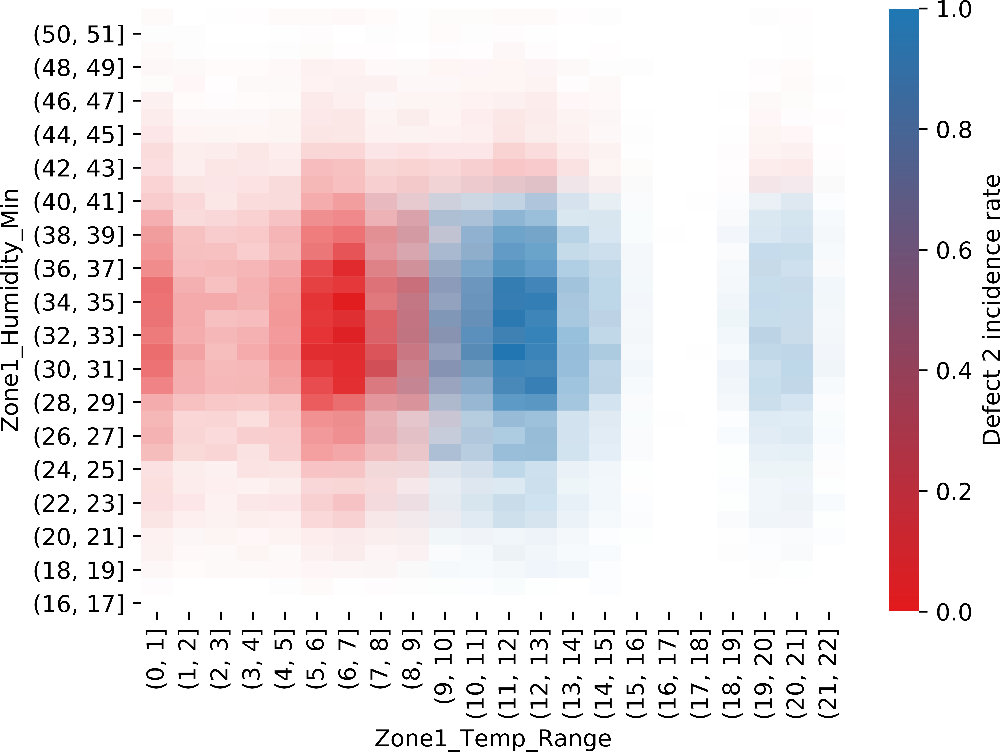

# Project black

Data science project conducted as a part of a (great) team (the "black team", re-baptized the "black sybil") for the
"Women in Data Science Accelerator" program (dates) organized by Accenture.

## Business problem statement

Following changes in the manufacturing pipeline, a company (PRODCO), is experiencing an unacceptably high defect rate
in their manufacturing process (~19%) resulting in:

- customer dissatisfaction;
- reputational damage;
- loss of business:
    - 1.1 million per quarter lost in (increased) inspection costs
    - 18 million lost in Q4 of 2018 due to defective components.

Our team developed an analysis pipeline to:

- clean and quality control manufacturing data made available by the company;
- gain insights into the types of defective components being produced and their impact on business
- perform a root cause analysis for all the "types" of defective components identified
- provide data-driven recommendations into how to handle the problem with expected savings from implementing recommended
  actions estimated to be in the ~13 million per quarter region.

We identified 4 types of manufacturing defects. By accounting the number of defective products per type and their price,
we ranked financial opportunities by potential savings. The focus of my analysis was on "opportunity 1" (Defect 2 in
non-A001 SKU products). Complete analysis is included in [analysis summary](https://github.com/ManuelaS/project_black/blob/master/summary.md).

## Root-cause analysis for "opportunity 1"

### Where in the manufacturing pipeline does the problem stem from?

Defects 2 in non A001 SKUs mostly affects 7 positions across the 3 zones. **How do we infer which zone is the root cause?**

- If the root cause was in zone 1 then defect products coming from position 3 zone 1, would have flowed through position 2
in zone 2 and be over-represented in position 2 and 3 in zone 3 as well as position 6. Similarly, the products from
positions 4, 7 and 8 would have cascaded down to other positions in zone 3.

- We can rule out a root cause in zone 2 with the same argument.

- The problem affects multiple positions in zones 1 and 2, but it is largely seen in position 6 zone 3. While it would be
possible for multiple positions in the same zone to be problematic, we can rule out problems upstream of zone 3 because
the defect would have manifested with defect products in multiple position in zone 3.

- **The only root cause consistent with the defects symptoms is a root cause related to position 6 zone 3.**

### What factors may be contributing?

A decision tree confirms the dependency on zone 3 position 6 and also involves the temperature and humidity in zone 1. 
The problem manifests for products that go through position 6 with high temperature range in zone 1 and a low minimum
humidity. Even though the partial dependency plot shows a hard threshold for humidity, it doesn’t affect as many samples
because the humidity is lower than this threshold for the vast majority of products as seen if we highlight the sample
frequency.

The interaction between the position in zone 3 and temp/humidity in zone 1 is counter-intuitive and we are interested in
the company evaluating how it fits.

### Intervention recommendation

This defect currently causes a loss in sales of 6.5 mil per quarter, with our approach we can identify and recover 85%.
The problem can be addressed by either fixing zone 1 or 3 and since the maintenance costs for zone 1 are lower (even
after accounting for factory shutdown during the fix), we would recommend fixing zone 1 to get a return of 3.7 mil.
