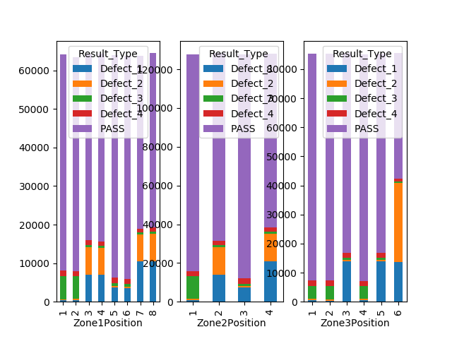

# Data cleaning
- use 'WIDS_Dataset_Full_Aug18_Jan19_Adjusted.csv'
- impute missing data for zone 1-3 based on rules defined according to pdf brief:
  - 97.36% fraction of samples have positional information for Zone1
  - 99.93% fraction of samples have positional information for Zone1 after imputation.
  - 97.33% fraction of samples have positional information for Zone2
  - 99.86% fraction of samples have positional information for Zone2 after imputation.
  - 97.34% fraction of samples have positional information for Zone3
  - 99.90% fraction of samples have positional information for Zone3 after imputation.

# Defect counts

- SKU A001 has higher defect rate than the other SKUs. 

# Defect counts, details

- SKU A001 mostly suffers from Defect_1.
- The other SKUs appear to have similar incidence rates for the different defects. Common root cause?
  - Defect_2 has the biggest incidence rate among these SKUs
  
# Defect financial impact

- Scaled by cost, SKU A001 and B003 defects is a relatively smaller issue and X007 and Z009 relatively bigger. 

# Financial opportunities


If we assume that the defects in the SKUs other than A001 have common root cause (based on SKU_vs_Result_Type showing
very similar incidence rates across these SKUs), our biggest opportunities are:
- Opportunity 1: Defect 2 across the non-A001 SKUs (~13 mill Euro)
- Opportunity 2: Defect_1 in A001 (~12 mill Euro)
- Opportunity 3: Defect_3 across the non-A001 SKUs (~5 mill Euro)
- Opportunity 4: Defect_4 across the non-A001 SKUs (~3.5 mill Euro)

# Opportunity 1, Defect 2 across non-A001 SKUs


Defect 2 for non-A001 SKUs appear over-represented in products produced:
- In Zone3Position 6
- with high Zone1TempRange (>8.96)
- (depending on Zone1 temperature and humidity)

# Partial dependency plot for Zone 1 min/max temperatures for non-A001 SKUs in Zone 3 position 6


Practically all of Defect 2 for non-A001 SKUs can be explained by min/max temperatures in Zone1
for items produced in zone 3 position 6.

# Breakdown of defects occurrence by zone 1-3 positions



Similarly, Defect 3 appears to affect mostly products produced in position 1 of zone 2.

# Predictive modelling for defects
- balance dataset to achieve equal relative representation of PASS, Defect 1, Defect 2, Defect 3, Defect 4.
- use classification random forest for modelling
- balanced accuracy = 0.69 (vs. 0.2 expected by chance)
- detailed classification report:
```

                f1-score    precision    recall    support
------------  ----------  -----------  --------  ---------
Defect_1        0.930901     0.923827  0.938083       5249
Defect_2        0.928388     0.962569  0.896552       5249
Defect_3        0.754316     0.813216  0.703372       5249
Defect_4        0.437269     0.423896  0.451515       5249
PASS            0.441852     0.417642  0.469042       5249
micro avg       0.691713     0.691713  0.691713      26245
macro avg       0.698545     0.70823   0.691713      26245
weighted avg    0.698545     0.70823   0.691713      26245
```

- confusion matrix:


- variable importance as returned by the random forest classifier:


